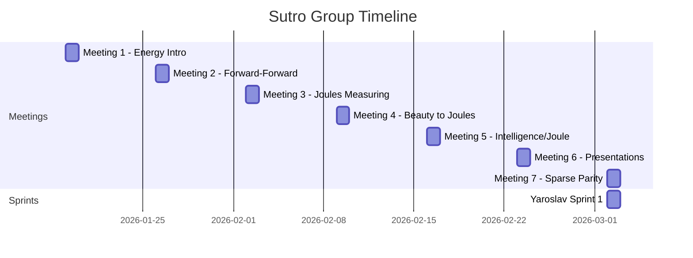

# Context

## What is this?

A research environment for the Sutro Group's work on energy-efficient AI training. The group's thesis: go back to 1960s-era AI problems and reinvent learning algorithms using modern tools (AI agents, compute), with energy efficiency as the optimization target.

## Why Sparse Parity?

Sparse parity is the "drosophila" of learning tasks:

- **Simplest non-trivial** learning problem (XOR was the example Minsky used to trigger the AI winter)
- **Easy to scale** difficulty (add noise bits)
- **Fast to iterate** (<1 second training + eval)
- **Exposes fundamental** memory access patterns in backprop

## Key Insight from Sprint 1

!!! warning "The ARD Bottleneck"
    Standard backprop has an inherent Average Reuse Distance bottleneck: parameter tensors (W1, b1) are read in the forward pass and again at the end of the backward pass, with the entire computation in between.

Gradient fusion (fusing weight updates) only helps ~5% of total memory reads. Real improvement requires:

- Per-layer forward-backward without full network propagation
- Hinton's Forward-Forward algorithm
- Other non-backprop learning rules

## Timeline

## People

| Name | Role / Focus |
|------|-------------|
| **Yaroslav** | Repo owner, technical sprints, algorithm work |
| **Emmett** | Aster agentic loop framework, 2x energy improvement on microgpt |
| **Germaine** | Presentations, implementations |
| **Andy** | Chat tooling experiments |
| **Seth** | Healthcare AI, satisficing concepts |
| **Barak** | Modal workflow |
| **Jamie Simon** | Forward-Forward implementation |
| **Jonathan Belay** | Deterministic methods, spectral graph theory |
| **Anish Tondwalkar** | Former Google Brain/OpenAI, hardware perspective |
| **Caleb Sirak** | DIY AI supercomputer ("Howard") |
