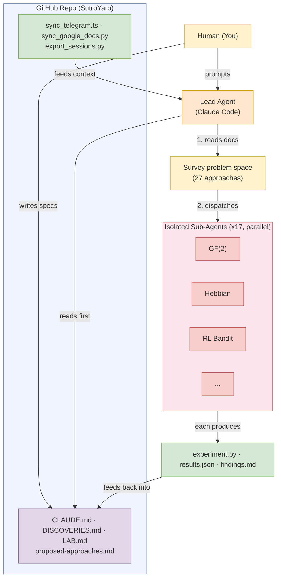

# Tooling

How we use Claude Code as a research automation tool for the Sutro Group.

## How It Works

The human writes specs (CLAUDE.md, DISCOVERIES.md, LAB.md). The lead agent reads those, surveys the problem space, then dispatches isolated sub-agents in parallel. Each sub-agent gets one approach, the experiment template, and shared modules. No sub-agent sees another's results. Outputs feed back into DISCOVERIES.md for the next round.

## The Stack

| Tool | What it does |
|------|-------------|
| [Claude Code](claude-code-setup.md) | AI coding agent in the terminal — runs experiments, writes findings, manages the MkDocs site |
| [CLAUDE.md](claude-code-setup.md#claudemd) | Project instructions file that gives Claude context about the repo |
| [Superpowers plugin](skills.md) | [obra/superpowers](https://github.com/obra/superpowers) — brainstorming, TDD, debugging, parallel agents, code review |
| [Custom skills](skills.md#custom-skills) | Anti-slop guide, Ralph Wiggum |
| [MCP servers](skills.md#mcp-servers) | Extensible tool servers (Google Docs, browser, diagrams) |
| [Anti-slop guide](anti-slop-guide.md) | Reference for eliminating AI writing patterns from prose |
| [Automation scripts](automation.md) | `sync_google_docs.py` for pulling Google Docs, `sync_telegram.ts` for pulling Telegram threads, session trace export |

## What Worked

The combination that produced 16 experiments in a few days:

1. **CLAUDE.md as shared context** — Every Claude Code session starts by reading the project state, findings, and working style rules
2. **LAB.md as experiment protocol** — Enforces one-hypothesis-per-experiment, baselines, and commit discipline
3. **Anti-slop on all prose** — Keeps documentation readable by humans, not just LLMs
4. **Parallel agents** — Multiple Claude Code instances running independent experiments simultaneously
5. **Sub-2-second iteration** — `fast.py` (numpy) keeps the feedback loop tight enough for hundreds of experiments per hour

## What to Try Next

- MCP servers for direct Google Docs access (currently using export URLs)
- Hooks for auto-running experiments on file save
- Custom skills for the Sutro research loop (literature search, hypothesis, experiment, measure)
- Memory files for cross-session learning about what hyperparameters work
